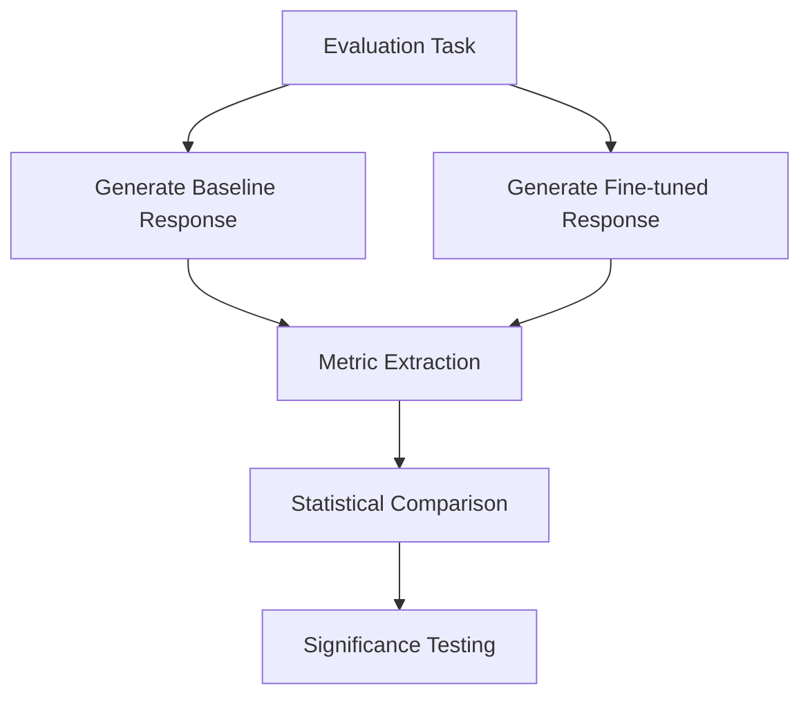

# MCP Model Evaluation Methodology

This document outlines the systematic approach for evaluating whether an MCP-finetuned model outperforms the baseline model on MCP-specific tasks.

## Evaluation Goals

1. **Quantify Performance Improvements**: Measure specific performance deltas between the baseline and fine-tuned models
2. **Identify Capability Differentiators**: Determine which MCP capabilities show the most improvement
3. **Validate Training Process**: Confirm that fine-tuning improves performance without degrading general capabilities
4. **Guide Future Training**: Identify areas requiring additional fine-tuning examples

## Evaluation Dataset Construction

The evaluation dataset should be separate from the training dataset and organized as follows:

### 1. Task Categories

| Category | Description | Example Tasks |
|----------|-------------|--------------|
| **Tool Selection** | Choosing the appropriate MCP tool | "Find all files containing the term 'config'" |
| **Parameter Handling** | Structuring tool parameters correctly | "List all commits by author 'jdoe@example.com'" |
| **Multi-step Reasoning** | Using tools in sequence | "Find the most recently updated JSON file and validate its schema" |
| **Error Recovery** | Handling and recovering from errors | "Try to execute a command with permissions issues" |
| **Complex Reasoning** | Complex problem solving with tools | "Analyze code patterns across multiple repositories" |

### 2. MCP Server Distribution

Include tasks for each MCP server type with appropriate representation:

- **Filesystem**: 20% (common file operations)
- **Git**: 20% (repository operations)
- **GitHub**: 20% (issues, PRs, code search)
- **Database**: 20% (query execution, schema exploration)
- **Custom Tools**: 20% (weather, calculator, image processing)

### 3. Complexity Levels

- **Simple**: 30% (single tool use)
- **Moderate**: 40% (2-3 tool calls in sequence)
- **Complex**: 30% (multi-tool processes with reasoning)

## Evaluation Metrics

### 1. Primary Metrics

| Metric | Description | Calculation |
|--------|-------------|-------------|
| **Tool Selection Accuracy** | Correct tool selection rate | `correct_tools / total_tasks` |
| **Parameter Accuracy** | Parameter formatting correctness | `correct_parameters / total_parameters` |
| **Task Completion Rate** | Successfully completed tasks | `completed_tasks / total_tasks` |
| **XML Validity Rate** | Syntactically valid XML responses | `valid_xml / total_responses` |
| **Reasoning Quality** | Quality of reasoning (1-5 scale) | Average rating by evaluators |

### 2. Secondary Metrics

| Metric | Description | Calculation |
|--------|-------------|-------------|
| **Response Latency** | Time to generate a response | Average generation time |
| **Hallucination Rate** | Fabricated tool features | `hallucinated_features / total_responses` |
| **Instruction Following** | Adherence to instructions | `followed_instructions / total_tasks` |
| **Recovery Rate** | Recovery from errors | `successful_recoveries / error_situations` |

## Evaluation Process

### 1. A/B Testing Framework



### 2. Automated Evaluation Components

1. **XML Structure Validator**
   ```python
   def validate_xml_structure(response):
       """Check XML structure validity"""
       patterns = {
           'opening_tag': r'<(\w+)>',
           'closing_tag': r'</(\w+)>',
           'server_tag': r'<server_name>(.*?)</server_name>',
           'tool_tag': r'<tool_name>(.*?)</tool_name>',
           'arguments_tag': r'<arguments>(.*?)</arguments>'
       }
       # Return validation results
   ```

2. **Tool Selection Validator**
   ```python
   def validate_tool_selection(response, task):
       """Check if the right tool was selected"""
       # Extract tool name from response
       # Compare against expected tool for task
       # Return True/False with confidence score
   ```

3. **Parameter Structure Validator**
   ```python
   def validate_parameters(response, task):
       """Check if parameters are correctly structured"""
       # Extract parameter JSON from response
       # Validate JSON structure
       # Check required parameters presence
       # Return correctness score (0-1)
   ```

### 3. Human Evaluation Elements

For aspects requiring human judgment:

1. **Reasoning Quality Assessment**
   - Clarity of explanation (1-5)
   - Logical flow (1-5)
   - Appropriate detail level (1-5)
   - Task relevance (1-5)

2. **Overall Response Quality**
   - Pairwise comparison (Which response better addresses the task?)
   - Absolute quality rating (1-10)
   - Error identification and severity rating

## Blind Evaluation Protocol

To ensure unbiased evaluation:

1. Model identities concealed during evaluation (labeled as Model A/B)
2. Randomized response order for each task
3. Multiple evaluators per task with inter-rater reliability calculation
4. Evaluation rubrics established before seeing model outputs

## Evaluation Interface

Create a web interface for evaluators with:

1. Task description display
2. Side-by-side response comparison (randomized positioning)
3. Scoring interface for all metrics
4. Comments field for qualitative observations
5. Time tracking for evaluation decisions

## Statistical Analysis

1. **Hypothesis Testing**
   - Null hypothesis: Fine-tuned model performs no better than baseline
   - Alternative hypothesis: Fine-tuned model outperforms baseline
   - Significance level: p < 0.05

2. **Metrics Aggregation**
   - Per-category performance (tool selection, parameters, etc.)
   - Per-server type performance (filesystem, git, etc.)
   - Per-complexity level performance (simple, moderate, complex)

3. **Visualization**
   - Performance radar charts by category
   - Box plots for metric distributions
   - Heat maps for task-specific performance differences

## Evaluation Implementation

### Required Components

1. **Task Runner**
   - Load evaluation tasks
   - Submit to models
   - Collect responses

2. **Metric Extractor**
   - Process responses
   - Apply automated metrics
   - Prepare for human evaluation

3. **Results Dashboard**
   - Display comparative metrics
   - Statistical significance indicators
   - Filter by task categories/complexity

4. **Report Generator**
   - Summarize findings
   - Generate visualizations
   - Identify improvement areas

## Example Evaluation Task

**Task ID**: FS-103
**Category**: Filesystem > Multi-step
**Description**: "Find all Python files in the src directory that import the 'os' module, and show the function that uses it most frequently."

**Expected Process**:
1. Use filesystem search to find Python files
2. For each file, read content and check for 'import os'
3. Analyze function usage frequency
4. Return the most frequent user

**Evaluation Criteria**:
- Tool Selection: Use of search_files and read_file tools
- Parameter Accuracy: Correct path and pattern parameters
- Reasoning: Clear explanation of analysis process
- Task Completion: Identification of correct function

## Reporting Format

The final evaluation should include:

1. **Executive Summary**
   - Overall performance comparison
   - Key areas of improvement
   - Statistical significance of results

2. **Detailed Metrics**
   - Complete metrics breakdown
   - Per-category analysis
   - Individual task performance

3. **Error Analysis**
   - Common failure patterns
   - Systematic issues
   - Improvement recommendations

4. **Training Recommendations**
   - Additional example types needed
   - Task categories requiring reinforcement
   - Parameter handling improvements

This evaluation methodology provides a comprehensive framework for assessing whether the MCP-finetuned model outperforms the baseline on MCP-specific tasks, with both quantitative metrics and qualitative assessments.