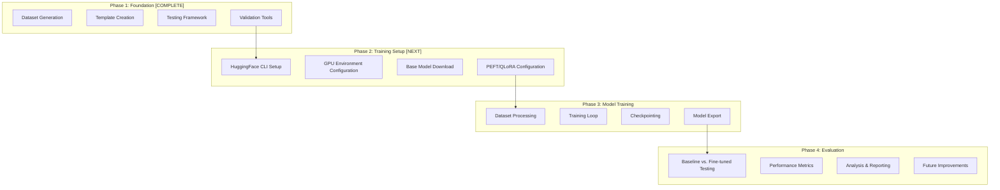

# MCP Fine-tuning Implementation Roadmap

This document provides an overview of the planned implementation for the MCP fine-tuning project, integrating the various components we've designed.

## Project Status

We have successfully completed the dataset generation phase:
- ✅ Created utilities for template generation
- ✅ Implemented dataset creation and validation tools
- ✅ Refactored all utilities to use UV instead of direct Python
- ✅ Added comprehensive testing with GitHub issue creation
- ✅ Implemented a full validation workflow

## Implementation Roadmap

## Key Documents

| Document | Purpose | Content |
|----------|---------|---------|
| **README.md** | Project overview | Introduction, features, getting started guide |
| **TODO.md** | Implementation tasks | Detailed tasks for Phases 2-4 |
| **justfile-updates.md** | Workflow automation | Changes needed for HuggingFace integration |
| **training-implementation-plan.md** | Technical reference | GPU optimization, code snippets for implementation |
| **evaluation-methodology.md** | Evaluation framework | Metrics and methodology for model comparison |

## Next Steps

### Immediate Actions (Code Mode)

1. **Environment Setup**
   - Update justfile with HuggingFace CLI integration
   - Create GPU verification script
   - Set up model directories

2. **Training Pipeline**
   - Implement core training scripts (`train.py`)
   - Create dataset processing utilities
   - Configure QLoRA parameters for RTX 3090

3. **Evaluation Framework**
   - Implement evaluation task runner
   - Create metric extractors
   - Set up A/B testing framework

## Memory Optimization Strategy

For the RTX 3090 (24GB VRAM), our approach uses:

1. **4-bit Quantization**: Reduce model memory footprint by 75%
2. **Parameter-Efficient Fine-tuning**: Train only 0.1-1% of parameters
3. **Gradient Accumulation**: Simulate larger batch sizes
4. **Flash Attention**: Reduce attention computation memory

## Expected Outcomes

1. **Performance Improvement**: Significant increase in MCP tool usage accuracy
2. **XML Structure Quality**: Better formatting of MCP XML responses
3. **Task Completion**: Higher success rate on complex MCP tasks
4. **Generalization**: Improved performance across all MCP server types

## Implementation Timeline

| Week | Focus | Key Deliverables |
|------|-------|-----------------|
| **Week 1** | Environment Setup | GPU verification, HF integration, model download |
| **Week 2** | Training Pipeline | Dataset processing, training loop, checkpointing |
| **Week 3** | Evaluation System | A/B testing, metrics, performance analysis |
| **Week 4** | Optimization | Hyperparameter tuning, final model delivery |

## Mode Switch Recommendation

To begin implementing these plans, we should switch to Code mode to make the necessary code changes to the justfile and create the training infrastructure components.

The architectural design is complete, and we now have a clear roadmap for implementation.