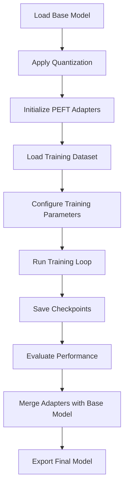

# MCP Fine-tuning Implementation Plan

## Hardware Considerations for RTX 3090 (24GB VRAM)

For efficient training on the RTX 3090, we need to carefully consider memory management strategies:

### Memory Optimization

| Technique | Impact | Implementation |
|-----------|--------|----------------|
| **QLoRA** | Low precision adapters (4-bit quantized weights) | Use `bitsandbytes` for quantization |
| **Gradient Checkpointing** | Trade compute for memory | Set `gradient_checkpointing=True` in model config |
| **Flash Attention** | Efficient attention computation | Use `xformers` or native Flash Attention 2 |
| **Mixed Precision** | 16-bit training | Use `torch.amp` or HF's `fp16=True` trainer setting |
| **Offload** | CPU offloading for optimizer states | Use `offload_optimizer=True` PEFT options |

### Optimal Batch Sizing

For Devstral with a 24GB GPU:
- Base model with 7B parameters
- Effective batch size: 1-4 sequences per iteration
- Gradient accumulation steps: 4-16
- Sequence length: Up to 8192 tokens (context-dependent)

## Training Pipeline Implementation



### Key Files to Implement

1. `src/train.py`: Main training script
2. `src/data_processing.py`: Dataset processing utilities
3. `src/model_utils.py`: Model loading/saving utilities
4. `src/evaluation.py`: Evaluation metrics and routines
5. `src/configuration.py`: Training configuration management

## Code Implementation Details

### Model Initialization with QLoRA

```python
from transformers import AutoModelForCausalLM, AutoTokenizer, BitsAndBytesConfig
from peft import LoraConfig, get_peft_model

def initialize_model(model_path):
    # Quantization configuration
    quant_config = BitsAndBytesConfig(
        load_in_4bit=True,
        bnb_4bit_compute_dtype=torch.float16,
        bnb_4bit_quant_type="nf4",
        bnb_4bit_use_double_quant=True,
    )

    # Load model with quantization
    model = AutoModelForCausalLM.from_pretrained(
        model_path,
        quantization_config=quant_config,
        device_map="auto",
        trust_remote_code=True,
    )

    # LoRA configuration
    lora_config = LoraConfig(
        r=16,                     # Rank
        lora_alpha=32,            # Alpha scaling
        target_modules=["q_proj", "v_proj"],  # Target linear layers
        lora_dropout=0.05,        # Dropout probability
        bias="none",              # Bias handling
        task_type="CAUSAL_LM",    # Task type
    )

    # Apply LoRA adapters
    model = get_peft_model(model, lora_config)

    # Load tokenizer
    tokenizer = AutoTokenizer.from_pretrained(model_path)

    return model, tokenizer
```

### Dataset Processing with Loss Masking

```python
from datasets import load_dataset
from transformers import DataCollatorForSeq2Seq
import torch

def prepare_dataset(dataset_path, tokenizer, max_length=8192):
    # Load dataset
    dataset = load_dataset("json", data_files=dataset_path)

    # Process dataset
    def preprocess_function(examples):
        # Format inputs
        prompts = examples["instruction"]
        completions = examples["completion"]
        texts = [f"Instruction: {prompt}\nResponse: {completion}" for prompt, completion in zip(prompts, completions)]

        # Tokenize
        tokenized = tokenizer(texts, truncation=True, max_length=max_length, padding=False)

        # Create labels for completion-only training
        labels = tokenized["input_ids"].copy()

        # Find the position of "Response:" in each example
        for i, text in enumerate(texts):
            response_pos = text.find("Response:")
            if response_pos != -1:
                # Convert character position to token position (approximate)
                response_token_pos = len(tokenizer.encode(text[:response_pos + 9]))  # +9 for "Response:"
                # Mask instruction tokens from loss
                labels[i][:response_token_pos] = [-100] * response_token_pos

        return {
            "input_ids": tokenized["input_ids"],
            "attention_mask": tokenized["attention_mask"],
            "labels": labels,
        }

    # Preprocess dataset
    processed_dataset = dataset["train"].map(
        preprocess_function,
        batched=True,
        remove_columns=["instruction", "completion", "metadata"],
    )

    return processed_dataset
```

### Training Configuration

```python
from transformers import TrainingArguments

def get_training_args(output_dir):
    return TrainingArguments(
        output_dir=output_dir,
        learning_rate=2e-4,
        num_train_epochs=3,
        weight_decay=0.01,
        warmup_ratio=0.03,
        per_device_train_batch_size=1,
        gradient_accumulation_steps=8,
        gradient_checkpointing=True,
        fp16=True,
        save_strategy="steps",
        save_steps=100,
        logging_steps=10,
        report_to="tensorboard",
        remove_unused_columns=False,
    )
```

### Training Loop

```python
from transformers import Trainer

def train(model, tokenizer, dataset, training_args):
    # Initialize Trainer
    trainer = Trainer(
        model=model,
        args=training_args,
        train_dataset=dataset,
        tokenizer=tokenizer,
    )

    # Train model
    trainer.train()

    # Save model
    model.save_pretrained(training_args.output_dir)
```

### Evaluation Framework

Create a robust evaluation framework to compare baseline and fine-tuned models:

1. **MCP Task Categories**
   - Tool selection accuracy
   - Parameter formatting correctness
   - Response completeness
   - Error handling appropriateness

2. **Metrics Collection**
   - Success rate on MCP tasks
   - XML tag validity
   - Response relevance
   - Execution time

3. **A/B Testing Process**
   - Generate responses from both models
   - Compare based on predefined rubric
   - Calculate statistical significance of improvements

## Implementation Timeline

1. **Week 1: Environment Setup**
   - GPU configuration
   - HuggingFace integration
   - Baseline model setup

2. **Week 2: Training Pipeline**
   - Dataset processing
   - Training loop implementation
   - Checkpoint management

3. **Week 3: Evaluation System**
   - Metrics implementation
   - A/B testing
   - Performance analysis

4. **Week 4: Optimization**
   - Hyperparameter tuning
   - Model merging and export
   - Documentation and delivery

This implementation plan provides a technical foundation for fine-tuning Devstral on MCP tasks using the RTX 3090 GPU.